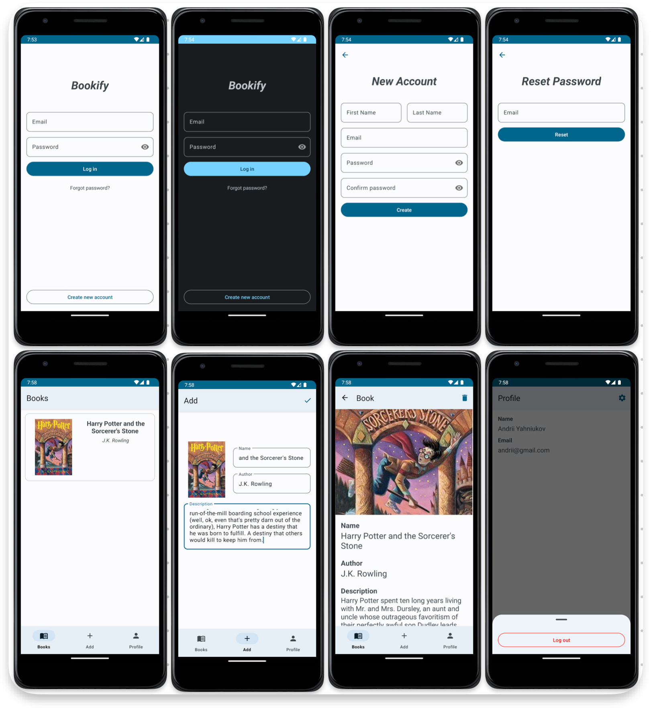

# Bookify

## About

### Description

Bookify is a pet-project that provides a way to store your favorite books

### Architecture

Clean Architecture with MVVM Pattern

### Technologies

- Kotlin (with Coroutines)
- Firebase (Auth/Realtime Database/Cloud Storage)
- Navigation
- Dagger-Hilt
- LiveData
- Coil
- DiffUtil
- DataBinding

### Screenshots

